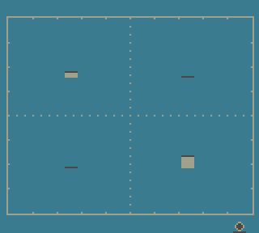

# GBVisualizer (mod)

A simple mod of the orignal demo by LIJI32 to demonstrate the use of the Gameboy Color registers, nicknamed PCM12 (FF76) and PCM34 (FF77), which can be used to read the current PCM amplitude of the 4 APU channels. 

Music for this demo is adapted from [LIJI32s disassembly of Super Bomberman](https://github.com/LIJI32/superbomberman/tree/master/dboot/songs).

This is how it looks on an emulator supporting these registers:  

